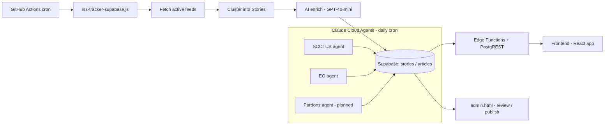

# TrumpyTracker Architecture (high-level)

> Living doc. Update only when the system **shape** changes (new pipeline, contract, data flow) — not for bugfixes or UI tweaks. Detail lives in `docs/explanation/` (and `docs/architecture/` until relabeled); decisions in `docs/decisions/`.

## What it is
AI political-accountability tracker. Four content types: **Stories** (clustered news), **Executive Orders**, **SCOTUS** cases, and **Pardons** — each ingested, AI-enriched, reviewed, and published.

## Pipeline flow

## Components (what each owns)
- **RSS pipeline** (`rss-tracker-supabase.js`): fetch → cluster → enrich, inline. Budget-capped ($5/day), runs every 2h on PROD via GitHub Actions.
- **Claude cloud scheduled agents**: SCOTUS (live), EO (live), Pardons (planned) enrichment. Single-pass fact+editorial; never auto-approve; human review required. $0 marginal (Anthropic subscription).
- **Supabase**: Postgres + Edge Functions + RLS. Separate TEST and PROD projects.
- **Frontend**: Vite/React app; PostgREST direct reads + some edge functions; deployed on Netlify.
- **Admin dashboard** (`admin.html`): review / publish / re-enrich across all four content types.

## Environments
- `test` branch → Supabase TEST → Netlify test site
- `main` (protected, PR-only) → Supabase PROD → trumpytracker.com
- Promotion: cherry-pick tested commits → PR to main. Never merge test→main.

## See also
- Why Claude agents replaced GPT/Perplexity pipelines → [decisions/0001-claude-agents-over-gpt-pipelines.md](decisions/0001-claude-agents-over-gpt-pipelines.md)
- How clustering works → `docs/architecture/clustering-scoring.md`
- RSS system detail → `docs/architecture/rss-system.md`
- Database schema → `docs/database/database-schema.md`
