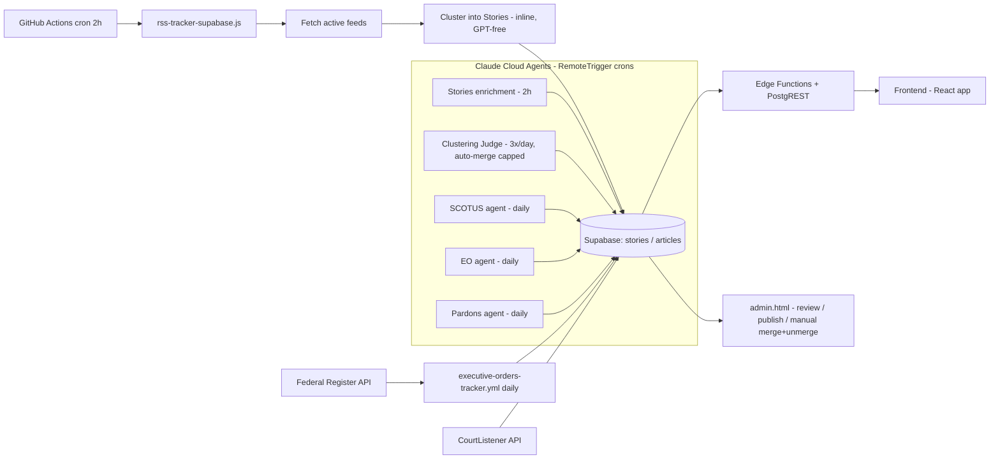

# TrumpyTracker Architecture (high-level)

> Living doc. Update only when the system **shape** changes (new pipeline, contract, data flow) — not for bugfixes or UI tweaks. Detail lives in `docs/explanation/` (and `docs/architecture/` until relabeled); decisions in `docs/decisions/`.

## What it is
AI political-accountability tracker. Four content types: **Stories** (clustered news), **Executive Orders**, **SCOTUS** cases, and **Pardons** — each ingested, AI-enriched, reviewed, and published.

## Pipeline flow (current state, 2026-08-05)

```mermaid
flowchart LR
  A[GitHub Actions cron 2h] --> B[rss-tracker-supabase.js]
  B --> C[Fetch active feeds]
  C --> D[Cluster into Stories - inline, GPT-free]
  D --> F[(Supabase: stories / articles)]

  subgraph Claude Cloud Agents - RemoteTrigger crons
    ST[Stories enrichment - 2h] --> F
    J[Clustering Judge - 3x/day, auto-merge capped] --> F
    S[SCOTUS agent - daily] --> F
    EO[EO agent - daily] --> F
    P[Pardons agent - daily] --> F
  end

  FR[Federal Register API] --> EOT[executive-orders-tracker.yml daily]
  EOT --> F
  CL[CourtListener API] --> F

  F --> G[Edge Functions + PostgREST]
  G --> H[Frontend - React app]
  F --> I[admin.html - review / publish / manual merge+unmerge]
```

## Who enriches what (the table to check before "turning something off")

| Domain | Ingestion (new rows) | Enrichment (AI content) | Legacy remnant |
|--------|---------------------|------------------------|----------------|
| Stories | `rss-tracker-supabase.js` (GitHub Actions, 2h) | **Claude Stories agent** (cloud cron, 2h) | GPT path still in repo, gated OFF by `ENABLE_LEGACY_STORY_ENRICHMENT` |
| Story merging | inline Tier A/B clustering | **Clustering Judge agent** (3x/day, prompt `judge-v1.1`) + admin manual merge/unmerge (ADO-537). Candidates carry **verdict memory** since migration 106 (ADO-539): a pair with a live verdict newer than either side's latest `article_story.matched_at` is skipped until a new article attaches — so a quiet Judge run is expected, not a fault. | — |
| Executive Orders | `executive-orders-tracker.yml` (daily 16:00 UTC) — raw-only since PR #110 (2026-08-05), zero GPT calls | **Claude EO agent** (cloud cron, daily) | None — legacy GPT enrichment removed (ADO-540). Do NOT kill the workflow — it's the only EO ingestion. |
| SCOTUS | `scripts/scotus/fetch-cases.js` (CourtListener, manual/periodic) | **Claude SCOTUS agent** (cloud cron, weekdays) | — |
| Pardons | `pardons-tracker.yml` (daily 18:00 UTC) — raw-only since ADO-553 (2026-08-22), zero Perplexity/GPT calls | **Claude Pardons agent** (cloud cron, daily) | None — legacy Perplexity/GPT phases removed (ADO-553); standalone `research-pardons.yml` / `enrich-pardons.yml` deleted. Do NOT kill the workflow — it's the only pardons ingestion. |

## What each secret actually powers (before rolling a key)

| Secret | Active consumers | Rolling it breaks |
|--------|-----------------|-------------------|
| `OPENAI_API_KEY` | AI PR code review (GPT-4o) — sole remaining consumer since ADO-540 | PR reviews |
| Anthropic (subscription) | All 5 Claude cloud agents via RemoteTrigger | All enrichment + Judge |
| `EDGE_CRON_TOKEN(_PROD)` | Edge function auth | Edge function calls |
| `COURTLISTENER_API_TOKEN` | SCOTUS case fetch | New SCOTUS cases |
| `ADMIN_DASHBOARD_PASSWORD` (Supabase secret) | admin edge functions (judge-log, judge-merge, etc.) | Admin dashboard actions |

## Kill switches (repo variables unless noted)

| Switch | Governs | Default |
|--------|---------|---------|
| `ENABLE_PROD_SCHEDULES` | ALL scheduled PROD GitHub Actions (RSS **and** EO tracker) | `true` |
| `ENABLE_LEGACY_STORY_ENRICHMENT` | Retired GPT story enrichment path | unset/off |
| `ENABLE_TIERB_MARGIN_BYPASS` | Tier B clustering margin bypass | `true` |
| `JUDGE_DRY_RUN` (cloud agent env) | Judge live-merge vs dry-run (`'false'` = live) | `false` (live) |
| Disable a RemoteTrigger cron | Any single Claude agent | — |

## Components (what each owns)
- **RSS pipeline** (`rss-tracker-supabase.js`): fetch → cluster, inline. Budget-capped ($5/day), runs every 2h on PROD via GitHub Actions.
- **Claude cloud scheduled agents**: Stories, Judge, SCOTUS, EO, Pardons — all LIVE. Single-pass fact+editorial. $0 marginal (Anthropic subscription).
- **Supabase**: Postgres + Edge Functions + RLS. Separate TEST and PROD projects.
- **Frontend**: Vite/React app; PostgREST direct reads + edge functions; deployed on Netlify.
- **Admin dashboard** (`admin.html`): review / publish / re-enrich across all four content types; Judge tab with manual merge + unmerge (ADO-537).

## Environments
- `test` branch → Supabase TEST → Netlify test site
- `main` (protected, PR-only) → Supabase PROD → trumpytracker.com
- Promotion: cherry-pick tested commits → PR to main. Never merge test→main.

## See also
- Why Claude agents replaced GPT/Perplexity pipelines → [decisions/0001-claude-agents-over-gpt-pipelines.md](decisions/0001-claude-agents-over-gpt-pipelines.md)
- Judge deploy tally → `docs/features/clustering-judge/prod-deployment-manifest.md`
- How clustering works → `docs/architecture/clustering-scoring.md`
- RSS system detail → `docs/architecture/rss-system.md`
- Database schema → `docs/database/database-schema.md`
- Cloud agent mechanics → `docs/reference/cloud-agent-runbook.md`
